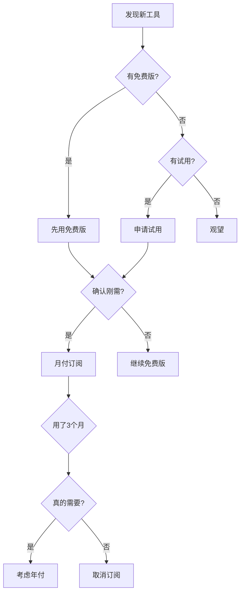

<Callout type="note" title="核心理念">
想法跑得比钱包快?先用好下列策略:**免费额度薅到底、合购+月付、预算留给真正刚需**。
</Callout>

---

## 📋 内容导航

<Steps>
### 免费额度与薅羊毛
学会利用各平台的免费额度

### 合购拼车策略
降低订阅成本的技巧

### 订阅节奏规划
什么时候该付费,什么时候等等

### 预算提醒
真实成本参考
</Steps>

---

## 1️⃣ 免费额度与薅羊毛

### 免费 AI 模型推荐

| 工具 | 免费额度 | 限制 | 推荐指数 |
|------|---------|------|----------|
| **Gemini** | 60 次/分钟 | 需要 Google 账号 | ⭐⭐⭐⭐⭐ |
| **Claude Web** | 有限制 | 够学习使用 | ⭐⭐⭐⭐ |
| **CodeBuddy** | GPT-4 免费 | 每日限额 | ⭐⭐⭐⭐ |
| **Bolt** | 30k tokens/天 | - | ⭐⭐⭐ |

<Callout type="tip" title="多账号策略">
多个账号轮流使用免费配额,不同平台互补,别把所有需求压在一个工具上
</Callout>

### 免费开发工具

**AI 编码助手:**
- Cursor (免费 2周试用)
- GitHub Copilot (学生免费)
- Codeium (永久免费)

**部署平台:**
- Vercel (免费额度)
- Netlify (免费额度)
- Cloudflare Pages (免费)

### 部署平台对比

```bash
# Vercel - 适合 Next.js
- 100GB 带宽/月
- 无限部署
- 自动 HTTPS

# Cloudflare Pages - 最慷慨
- 无限带宽
- 无限部署
- 免费 Workers
```

---

## 2️⃣ 合购/拼车

<Callout type="warn" title="风控提醒">
<AlertTriangle className="inline mr-2" />
合购账号存在风控风险,请谨慎使用!
</Callout>

<Accordions>
<Accordion title="V0 账号合购 (推荐)">

**平台**: 闲鱼"海鲜市场"
**价格**: 一年不到 200 元
**来源**: 糖饼实测
**适用**: 新手短期使用

<Callout type="tip">
💡 **省钱技巧**: 先用免费版体验,确认刚需再购买
</Callout>

</Accordion>

<Accordion title="GPT Team 拼车 (高风险)">

**风险等级**: <X className="inline text-red-500" /> 高风险
**原因**: OpenAI 风控严格
**建议**: 不推荐新手使用

<Callout type="error">
🚫 **警告**: 可能导致账号被封,已购买额度无法退款
</Callout>

</Accordion>

<Accordion title="其他工具拼车">

**可以尝试的工具**:
- Notion (团队版)
- Figma (教育版)
- Adobe Creative Cloud

**注意事项**:
1. 选择信誉好的卖家
2. 保存好订单记录
3. 不要共享敏感信息

</Accordion>
</Accordions>

---

## 3️⃣ 订阅节奏

### 订阅决策流程图



### 订阅原则

<Steps>

### 原则1: 免费优先

先用免费额度体验,确认刚需再付费

**反例**: <X className="inline text-red-500" /> 看到广告就买年费

**正例**: <Check className="inline text-green-500" /> 用了2周觉得很好用,再考虑付费

### 原则2: 月付试水

绝多数工具提供月付或试用

<Callout type="tip">
💡 **Cursor 官方支持退款** (Never 亲测)
不要一开始就买年费!
</Callout>

### 原则3: 定期复盘

养成"到期前复盘"习惯

**复盘问题**:
- 这个月用了几次?
- 有替代方案吗?
- 降级可以吗?

### 原则4: 勇敢取消

不要因为"已经付费"就硬用

**及时止损** > **沉没成本**

</Steps>

---

## 4️⃣ 预算提醒

<Callout type="warn" title="真实成本参考">
<DollarSign className="inline mr-2" />
以下是社群成员的真实花费数据
</Callout>

<Tabs items={['Claude', 'Cursor', '其他工具']}>

<Tab value="Claude">

### Claude Code 成本

```bash
# 官方定价
- API 调用: 按 token 计费
- Claude Code: 深度使用远超 $20/月

# 社群反馈
- 大娄: "套餐不够用,需要提前准备预算"
- 建议: $50-100/月 (重度使用)
```

<Callout type="info">
💡 **省钱方案**:
- 使用中转 API (便宜 50%)
- 混合使用免费模型
- 控制调用频率
</Callout>

</Tab>

<Tab value="Cursor">

### Cursor 订阅方案

| 方案 | 价格 | 渠道 | 推荐度 |
|------|------|------|--------|
| 拼多多月号 | ¥38/月 | 第三方 | ⭐⭐⭐ |
| 官方标准版 | $20/月 | 官网 | ⭐⭐⭐⭐ |
| 官方专业版 | $40/月 | 官网 | ⭐⭐⭐⭐⭐ |

<Callout type="tip" title="升级路径">
1. **新手**: PDD 月号 38 元起步
2. **确认需要**: 转官方标准版
3. **深度使用**: 升级专业版
</Callout>

</Tab>

<Tab value="其他工具">

### 其他常见工具成本

```bash
# 必需工具
- GitHub Copilot: $10/月 (学生免费)
- Vercel Pro: $20/月 (可选)
- Domain: $10-15/年

# 可选工具
- V0: $20/月
- Figma: $12/月
- Notion: $8/月

# 月度总成本预估
- 最低配置: $0-20/月
- 标准配置: $50-100/月
- 重度使用: $100-200/月
```

</Tab>
</Tabs>

---

## 💡 省钱金句

<Callout type="note" title="核心原则">
<Quote className="inline mr-2" />
**"把钱花在刀刃上"** = 工具链稳定 > 一堆会员

能用免费版搞定的坚决不付费
</Callout>

> 省下来的每一笔钱,都能投入到更关键的事情上:
> 买域名、拉真实流量、或者犒劳自己继续坚持下去。

---

## 📚 相关阅读

<Files>
  <File name="账号注册与风控.mdx" icon={<User />} />
  <File name="账号养成与防封.mdx" icon={<Shield />} />
  <File name="设备选购与系统配置.mdx" icon={<Laptop />} />
</Files>

---

## 💬 讨论与反馈

<Callout type="info">
📝 **发现错误或想补充内容?**
欢迎在社群分享你的省钱技巧!
</Callout>

<div className="flex items-center gap-2 mt-4">
  <Badge>初学者友好</Badge>
  <Badge variant="secondary">省钱技巧</Badge>
  <Badge variant="outline">实战经验</Badge>
</div>

---

<div className="text-sm text-muted-foreground">
最后更新: 2025-11-08 | 阅读时长: 8分钟 | 作者: AI产品出海社群
</div>
